# SDAIA Capstone: Production Data Engineering & AI System

[](https://github.com/SDAIAAcademy)
[](https://python.org)
[](https://spark.apache.org)
[](https://delta.io)
[](https://kafka.apache.org)
[](https://airflow.apache.org)

## Project Overview and Problem Statement

Raw Customer Relationship Management (CRM) ticket exports are frequently plagued by missing satisfaction scores, unstandardized priority levels, duplicate submissions, and unstructured resolution descriptions. Directly ingesting unvalidated data into analytical and AI workflows causes invalid KPI reporting and hallucinated LLM responses.

This production-grade Data Engineering and AI pipeline ingests raw CRM support ticket data, enforces strict schema data contracts at entry, quarantines invalid records into a **Dead Letter Queue (DLQ)**, streams validated data into an **ACID-compliant Delta Lakehouse** (Bronze/Silver/Gold), executes automated **Great Expectations Quality Gates**, emits **OpenLineage** observability events, and powers a **Hybrid RAG (Retrieval-Augmented Generation)** AI system with dense-sparse search, Reciprocal Rank Fusion (RRF), Cross-Encoder reranking, and exact ticket citations.

---

## Dataset Description

The pipeline is built around the **Kaggle Customer Support Tickets CRM Dataset** (`customer_support_tickets.csv`), comprising 20,000 customer service ticket records with 12 core attributes:

| Field Name | Type | Description | Pydantic Contract |
|---|---|---|---|
| `Ticket_ID` | String | Unique ticket primary key (e.g. `TKT-100000`) | Required, Non-empty, Unique |
| `Customer_Name` | String | Full name of submitting customer | Required, Non-null |
| `Customer_Email` | String | Customer contact email address | Valid email string |
| `Ticket_Subject` | String | Short subject summary of issue | Optional string |
| `Ticket_Description` | Text | Detailed ticket text description | Chunked for RAG embeddings |
| `Issue_Category` | String | Categorization (`Technical`, `Account`, `Billing`, `General Inquiry`, `Product Feedback`) | Categorical validation |
| `Priority_Level` | String | Ticket priority (`Low`, `Medium`, `High`, `Critical`) | Value set check |
| `Ticket_Channel` | String | Ingestion channel (`Web Form`, `Chat`, `Email`, `Phone`) | Channel tracking |
| `Submission_Date` | Date | Ticket submission timestamp (`YYYY-MM-DD`) | ISO Date format |
| `Resolution_Time_Hours` | Numeric | Hours taken to resolve ticket | Numeric >= 0 |
| `Assigned_Agent` | String | Assigned support representative | Agent attribution |
| `Satisfaction_Score` | Numeric | Customer rating score (1 to 5) | Constrained: `1.0 <= score <= 5.0` |

---

## End-to-End System Architecture

```mermaid
flowchart TD
    subgraph Ingestion ["1. Streaming & Ingestion (Kafka + Pydantic)"]
        CSV[customer_support_tickets.csv] --> PROD[Kafka Producer]
        PROD --> RAW[Topic: support-tickets-raw]
        RAW --> PYD{Pydantic Schema Validation}
        PYD -->|Valid Records| VAL[Topic: support-tickets-valid]
        PYD -->|Invalid / Malformed| DLQ[Topic: support-tickets-dlq & Quarantine JSONL]
    end

    subgraph Lakehouse ["2. Delta Lakehouse Architecture"]
        VAL --> BRONZE[(Delta Bronze Layer\nRaw + System Metadata)]
        BRONZE --> MERGE{Delta MERGE Upsert\non Ticket_ID}
        MERGE --> SILVER[(Delta Silver Layer\nCleaned & Deduplicated)]
    end

    subgraph Governance ["3. Data Quality & Observability"]
        SILVER --> GE{Great Expectations\nQuality Gate >= 80%}
        GE -->|Fails < 80%| HALT[Halt Downstream Pipeline]
        GE -->|Passes >= 80%| LINEAGE[OpenLineage Event Tracker\nSTART / COMPLETE / FAIL]
    end

    subgraph Analytics ["4. Gold Business Layer"]
        LINEAGE --> GOLD1[(Gold Category Metrics)]
        LINEAGE --> GOLD2[(Gold Agent Performance)]
        LINEAGE --> GOLD3[(Gold SLA Breach Analysis)]
    end

    subgraph RAG_AI ["5. AI Systems & Hybrid RAG"]
        GOLD1 & GOLD2 --> CHUNK[Document Chunking & Overlap]
        CHUNK --> VECT[(ChromaDB Vector Store)]
        CHUNK --> BM25[(BM25 Sparse Keyword Index)]
        VECT & BM25 --> RRF[Reciprocal Rank Fusion RRF]
        RRF --> RERANK[Cross-Encoder Reranker]
        RERANK --> ANS[Grounded Answer & Citations]
    end

    subgraph Orchestration ["6. Apache Airflow Orchestration"]
        AIRFLOW[Apache Airflow DAG\nTaskFlow API Orchestration] -.-> Ingestion
        AIRFLOW -.-> Lakehouse
        AIRFLOW -.-> Governance
        AIRFLOW -.-> Analytics
        AIRFLOW -.-> RAG_AI
    end
```



---

## Technology Stack and Production Libraries

- **Data Ingestion & Streaming**: `kafka-python` / `confluent-kafka`, `pydantic v2`
- **Lakehouse & Data Engine**: `pyspark 3.5.0`, `delta-spark 3.2.0` (ACID MERGE, Schema Enforcement)
- **Data Quality & Governance**: `great-expectations`, `openlineage-python`
- **Orchestration**: `apache-airflow 2.8+` (TaskFlow `@dag`, `@task`)
- **AI & RAG Pipeline**: `chromadb`, `rank-bm25`, `sentence-transformers` (Cross-Encoder), `pandas`

---

## Repository Structure

```
sdaia-capstone-data-pipeline/
├── README.md                                    # Master Technical Documentation
├── requirements.txt                             # Production library dependencies
├── .gitignore                                   # Workspace git exclusion rules
├── IMPLEMENTATION_STATUS.md                     # Implementation verification checklist
├── customer_support_tickets.csv                 # Primary CRM dataset (20,000 records)
├── Modern Data Engineering...ipynb              # Comprehensive Colab & local notebook
└── src/                                         # Modular Source Code Package
    ├── __init__.py                              # Package root
    ├── config.py                                # Centralized configuration & environment setup
    ├── synthetic_data.py                        # Synthetic ticket generator & malformed injection
    ├── kafka_io.py                              # Kafka producer/consumer & Pydantic DLQ routing
    ├── lakehouse.py                             # Delta Bronze/Silver MERGE & Gold aggregations
    ├── quality.py                               # Great Expectations quality gate check
    ├── lineage.py                               # OpenLineage event emitter (START/COMPLETE/FAIL)
    ├── rag.py                                   # Hybrid RAG, RRF, Cross-Encoder & Citations
    ├── tasks.py                                 # Traced pipeline task definitions
    └── dag_pipeline.py                          # Airflow DAG definition & pipeline runner
```

---

## Installation and Setup Instructions

### 1. Clone Repository & Setup Virtual Environment

```bash
git clone https://github.com/Alanoud-Alotaibi/sdaia-capstone-data-pipeline.git
cd sdaia-capstone-data-pipeline

# Create and activate Python virtual environment
python -m venv venv
source venv/bin/activate        # Linux / macOS
# or
.\venv\Scripts\activate          # Windows PowerShell
```

### 2. Install Production Dependencies

```bash
pip install -r requirements.txt
```

---

## Pipeline Execution Steps

### Direct Python Execution

To execute the pipeline end-to-end on the CRM dataset:

```bash
python -c "from src.dag_pipeline import run_pipeline; run_pipeline('customer_support_tickets.csv')"
```

### Apache Airflow DAG Execution

1. Copy or link `src/dag_pipeline.py` into your Airflow DAGs directory (`$AIRFLOW_HOME/dags`).
2. Start Airflow Webserver and Scheduler:

```bash
airflow db init
airflow webserver -p 8080 &
airflow scheduler &
```

3. Enable and trigger `sdaia_capstone_pipeline_dag` via the Airflow UI (`http://localhost:8080`).

---

## Verification and Audit Evidence

### 1. Ingestion & Dead Letter Queue (DLQ)
- Valid records are passed to `TOPIC_VALID`.
- Records missing required fields (`Ticket_ID`, `Customer_Name`) or with invalid satisfaction scores (`> 5.0`) are routed to `TOPIC_DLQ` and appended to `./data/quarantine/quarantine.jsonl` with explicit rejection reasons.

### 2. Delta Lakehouse MERGE & Schema Enforcement
- **Bronze Layer**: Appends `_ingestion_time` and `_data_source`.
- **Silver Layer**: Executes `DeltaTable.merge()` on `Ticket_ID`.
- **Schema Enforcement**: Verified by attempting to write incompatible schema dataframes, triggering write rejection.

### 3. Great Expectations Quality Gate Failure Halt
- When quality score falls below `80.00%` (e.g., during malformed record injection), `RuntimeError` is raised, blocking downstream Gold layer and RAG pipeline execution.

### 4. Hybrid RAG Citation Output Example
```text
Based on historical resolution data for query 'Hours of operation inquiry':

Relevant support cases were identified under Category 'General Inquiry' handled by Agent David Kim.
Key context: "Ticket ID: TKT-100000 | Customer: George Simon | Category: General Inquiry..."

Source Citations:
  - [1] Ticket ID: TKT-100000 | Category: General Inquiry | Agent: David Kim (Relevance Score: 4.5)
  - [2] Ticket ID: TKT-100013 | Category: General Inquiry | Agent: David Kim (Relevance Score: 4.5)
  - [3] Ticket ID: TKT-100024 | Category: General Inquiry | Agent: David Kim (Relevance Score: 4.5)
```

---

## Troubleshooting Guide

| Issue | Root Cause | Solution |
|---|---|---|
| Kafka Producer Error | Broker not running on `localhost:9092` | Start Zookeeper & Kafka binaries or use built-in fallback validator |
| PySpark Java Gateway Error | Missing `JAVA_HOME` or Java 8/11/17 | Ensure OpenJDK 11+ installed and set `JAVA_HOME` environment variable |
| UnicodeEncodeError on Windows | Windows console CP1256 encoding mismatch | Set environment variable `$env:PYTHONIOENCODING='utf-8'` |

---

## Contributors and Git History

This project was developed by team members:
- **Alanoud Alotaibi** ([@Alanoud-Alotaibi](https://github.com/Alanoud-Alotaibi))
- **Rawan Alqahtani** ([@Rawan1H](https://github.com/Rawan1H))
- **Reem Alshathri** ([@ReemAlshathri74](https://github.com/ReemAlshathri74))

---

## Academic Attribution and Acknowledgments

This capstone project was delivered as part of the **SDAIA Academy Data Engineering Training Program**.

- **Organization**: [SDAIA Academy](https://github.com/SDAIAAcademy)
- **Program**: Data Engineering & AI Systems Track
- **Lead Instructor / Trainer**: Mohammed Albeladi
- **Repository**: [https://github.com/SDAIAAcademy](https://github.com/SDAIAAcademy)
